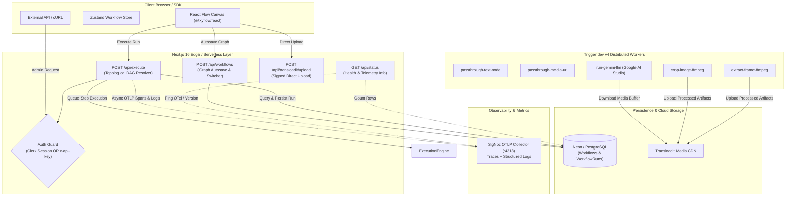

# NextFlow ⚡️

<div align="center">


**A high-performance visual DAG workflow engine chaining Google Gemini LLM, FFmpeg video/image transforms, and file pipelines with zero glue code.**

[](https://nextjs.org/)
[](https://react.dev/)
[](https://trigger.dev/)
[](https://prisma.io/)
[](https://neon.tech/)
[](https://signoz.io/)
[](https://transloadit.com/)
[](./package.json)

[🚀 Live Canvas](#-interactive-canvas--features) • [📐 Architecture](#-system-architecture) • [🧩 Node Catalog](#-node-catalog--capabilities) • [📡 API Reference](#-interactive-api-playground) • [🩺 Health Checks](#-service-health--telemetry) • [🛠 Quick Start](#-quickstart-guide)

</div>

---

## 📖 Table of Contents

- [⚡️ Overview](#%EF%B8%8F-overview)
- [📐 System Architecture](#-system-architecture)
- [🧩 Node Catalog & Capabilities](#-node-catalog--capabilities)
- [🚀 Interactive Canvas & Features](#-interactive-canvas--features)
- [🩺 Service Health & Telemetry](#-service-health--telemetry)
- [📡 Interactive API Playground](#-interactive-api-playground)
- [🛠 Quickstart Guide](#-quickstart-guide)
- [⚙️ Environment Configuration](#%EF%B8%8F-environment-configuration)
- [🧪 End-to-End Verification](#-end-to-end-verification)
- [❓ Interactive Troubleshooting & FAQ](#-interactive-troubleshooting--faq)

---

## ⚡️ Overview

Building multi-modal AI pipelines that combine LLM inference, video frame extraction, image cropping, and durable cloud storage usually turns into spaghetti scripts, fragile serverless timeouts, and lost execution states.

**NextFlow** replaces glue code with an intuitive directed acyclic graph (DAG) canvas backed by a robust distributed execution engine:

* **Topological DAG Runner**: Automatically determines node execution tiers, resolves upstream dependencies, and eliminates circular cycles.
* **Decoupled Heavy Compute**: Long-running AI generation and FFmpeg media transforms execute on **Trigger.dev v4 workers**—never blocking the Next.js API layer.
* **Direct Gemini Vision Inlining**: Fetches media securely into base64 `inlineData` buffers, providing Google Gemini with high-res multimodal inputs without exposing raw URLs.
* **Distributed Observability**: Emits OpenTelemetry (OTLP) Traces and structured logs straight to **SigNoz**, correlating workflow IDs, run IDs, and per-node execution timings.
* **Dual Auth Support**: Supports session-based user authentication via **Clerk** alongside machine-to-machine admin automation via `NEXTFLOW_API_KEY`.

---

## 📐 System Architecture

The following diagram illustrates how requests flow from the frontend canvas through authentication, topological dependency resolution, background workers, and telemetry:



---

## 🧩 Node Catalog & Capabilities

<details open>
<summary><b>1. Run Any LLM (Google Gemini)</b></summary>
<br>

* **Task ID**: `run-gemini-llm`
* **Default Model**: `gemini-2.5-flash` (configurable via `GEMINI_MODEL` or node parameters)
* **Ports**:
  * Inputs: `prompt` (string), `image` (image URL), `systemInstruction` (optional string), `temperature` (optional number)
  * Outputs: `text` (generated response string)
* **Vision Capability**: Downloads remote media securely into memory and constructs native `inlineData` parts with accurate MIME types before prompting Gemini.

```json
{
  "nodeType": "llm",
  "data": {
    "model": "gemini-2.5-flash",
    "prompt": "Analyze this screenshot and list UI improvements.",
    "temperature": 0.7
  }
}
```
</details>

<details>
<summary><b>2. Upload Media (Image & Video)</b></summary>
<br>

* **Task ID**: `passthrough-media-url`
* **Ports**:
  * Inputs: Direct file upload via Transloadit assembly
  * Outputs: `url` (valid HTTPS URL)
* **Validation**: Enforces HTTPS protocols, valid MIME types, and file size constraints via Zod before passing downstream.
</details>

<details>
<summary><b>3. Crop Image (FFmpeg)</b></summary>
<br>

* **Task ID**: `crop-image-ffmpeg`
* **Ports**:
  * Inputs: `imageUrl` (string), `x` (number), `y` (number), `width` (number), `height` (number)
  * Outputs: `url` (cropped image URL uploaded to Transloadit)
* **Worker Execution**: Runs `ffmpeg -i <input> -filter:v "crop=w:h:x:y" <output>` inside containerized Trigger.dev workers.
</details>

<details>
<summary><b>4. Extract Video Frame (FFmpeg)</b></summary>
<br>

* **Task ID**: `extract-frame-ffmpeg`
* **Ports**:
  * Inputs: `videoUrl` (string), `timestamp` (seconds, e.g. `12.5` or percentage `50%`)
  * Outputs: `url` (extracted frame JPEG URL)
* **Percentage Seeker**: Uses FFmpeg probes to inspect total duration and calculates exact frame offsets accurately.
</details>

<details>
<summary><b>5. Text Input & Constant</b></summary>
<br>

* **Task ID**: `passthrough-text-node`
* **Ports**:
  * Inputs: Direct textarea input or linked upstream string
  * Outputs: `text` (passthrough string)
* **Use Case**: Master system prompts, user templates, or structured JSON configurations.
</details>

---

## 🚀 Interactive Canvas & Features

### Core Canvas Highlights

1. **Multi-Canvas Switcher**: Seamlessly create, switch, and duplicate workflows directly in the canvas toolbar with the dropdown selector and `+ New` button.
2. **Topological Level Solver**: Automatically executes independent nodes concurrently while strictly ordering dependent operations.
3. **Execution Scopes**:
   * `Full`: Executes all nodes from roots to terminal leaves.
   * `Partial`: Executes selected nodes and their prerequisite ancestors.
   * `Single`: Executes a single isolated node with mock or resolved inputs.
4. **Resilient Graph History**: Undo/Redo stack with keyboard shortcuts (`Cmd+Z` / `Cmd+Shift+Z`), node duplication, and clean JSON export/import.
5. **Real-Time Step Details**: Detailed slide-out logs showing raw inputs, outputs, execution duration, and sanitized error traces.

---

## 🩺 Service Health & Telemetry

NextFlow includes a live health check endpoint at `/api/status` and native OpenTelemetry telemetry streaming.

### 1. Endpoint: `GET /api/status`

Verifies database connectivity, counts total workflows and runs, and inspects the SigNoz OTel Collector.

```bash
# Query health status
curl -s http://localhost:3000/api/status | jq .
```

<details open>
<summary><b>Click to view sample health response</b></summary>

```json
{
  "status": "online",
  "engine": "NextFlow Workflow Engine v1.0.0",
  "database": {
    "connected": true,
    "latencyMs": 42,
    "counts": {
      "workflows": 10,
      "runs": 48
    }
  },
  "signoz": {
    "connected": true,
    "endpoint": "http://127.0.0.1:4318",
    "version": "active",
    "apiKeyConfigured": false
  },
  "timestamp": "2026-10-06T01:05:00.000Z"
}
```
</details>

### 2. SigNoz Traces & Structured Logs

Whenever a workflow executes, NextFlow transmits:
* **Distributed Spans** for the root workflow run and each node execution step to `/v1/traces`.
* **Structured OTel Logs** with severity levels (`INFO` / `ERROR`), node timings, and user correlations to `/v1/logs`.
* **Sanitized Logs**: Sensitive API keys and tokens are stripped before leaving the server.

---

## 📡 Interactive API Playground

NextFlow provides RESTful endpoints authenticated via Clerk user sessions or the `x-api-key` header.

### 1. Save or Update a Workflow

```bash
curl -X POST http://localhost:3000/api/workflows \
  -H "Content-Type: application/json" \
  -H "x-api-key: your-nextflow-api-key" \
  -d '{
    "name": "Gemini Summarizer Workflow",
    "graphJson": {
      "nodes": [
        { "id": "text-1", "type": "text", "data": { "text": "Explain quantum computing in 2 sentences." } },
        { "id": "llm-1", "type": "llm", "data": { "model": "gemini-2.5-flash" } }
      ],
      "edges": [
        { "id": "e1", "source": "text-1", "target": "llm-1", "sourceHandle": "text", "targetHandle": "prompt" }
      ]
    }
  }'
```

### 2. Execute a Workflow Run

```bash
curl -X POST http://localhost:3000/api/execute \
  -H "Content-Type: application/json" \
  -H "x-api-key: your-nextflow-api-key" \
  -d '{
    "scope": "full",
    "name": "Gemini Summarizer Workflow",
    "nodes": [
      { "id": "text-1", "type": "text", "data": { "text": "What are quantum qubits?" } },
      { "id": "llm-1", "type": "llm", "data": { "model": "gemini-2.5-flash" } }
    ],
    "edges": [
      { "id": "e1", "source": "text-1", "target": "llm-1", "sourceHandle": "text", "targetHandle": "prompt" }
    ]
  }'
```

---

## 🛠 Quickstart Guide

### Prerequisites
* **Node.js**: `v20.x` or `v24.x`
* **Docker Desktop**: For running PostgreSQL and the OpenTelemetry / SigNoz Collector
* **API Credentials**: Google AI Studio Gemini API Key, Clerk Auth Keys, Transloadit Credentials

### 1. Clone & Install Dependencies

```bash
git clone https://github.com/HIMpcgithub3000/nextflow.git
cd nextflow
npm install
```

### 2. Configure Environment

Copy the example file and populate required credentials:

```bash
cp .env.example .env.local
```

### 3. Initialize Database

```bash
npx prisma generate
npx prisma migrate dev
```

### 4. Run Development Servers

```bash
# Terminal 1: Next.js Frontend & API Server
npm run dev

# Terminal 2: Trigger.dev Background Worker
npm run trigger:dev
```

Open [http://localhost:3000/workflow](http://localhost:3000/workflow) in your browser.

---

## ⚙️ Environment Configuration

| Variable | Required | Description |
|:---|:---:|:---|
| `DATABASE_URL` | **Yes** | PostgreSQL connection string (supports Neon pooled URLs) |
| `NEXT_PUBLIC_CLERK_PUBLISHABLE_KEY` | **Yes** | Clerk publishable frontend key |
| `CLERK_SECRET_KEY` | **Yes** | Clerk backend secret key |
| `GEMINI_API_KEY` | **Yes** | Google AI Studio API key |
| `GEMINI_MODEL` | No | Default model override (Default: `gemini-2.5-flash`) |
| `TRIGGER_PROJECT_ID` | **Yes** | Trigger.dev project identifier |
| `TRIGGER_SECRET_KEY` | **Yes** | Trigger.dev server secret key (`tr_dev_...` or `tr_prod_...`) |
| `TRANSLOADIT_AUTH_KEY` | **Yes** | Transloadit public API key |
| `TRANSLOADIT_AUTH_SECRET` | **Yes** | Transloadit API secret |
| `NEXTFLOW_API_KEY` | No | Secret key for automated M2M admin calls |
| `OTEL_EXPORTER_OTLP_ENDPOINT` | No | OTLP collector endpoint (Default: `http://127.0.0.1:4318`) |
| `SIGNOZ_ENDPOINT` | No | SigNoz frontend or API URL (Default: `http://127.0.0.1:8080`) |
| `SIGNOZ_API_KEY` | No | Ingestion/API key for SigNoz cloud |

---

## 🧪 End-to-End Verification

Follow these steps to confirm all services are healthy and operational:

```bash
# 1. Typecheck & Build validation
npm run build

# 2. Database connectivity test
npx prisma db execute --stdin <<< "SELECT 1;"

# 3. Service health check
curl -f http://localhost:3000/api/status

# 4. OpenTelemetry Collector check
curl -X POST http://127.0.0.1:4318/v1/traces -H "Content-Type: application/json" -d '{"resourceSpans":[]}'
```

---

## ❓ Interactive Troubleshooting & FAQ

<details>
<summary><b>Q: My Gemini node fails with "GoogleGenerativeAI Error: API key not valid"</b></summary>
<br>

**Solution**:
1. Check that `GEMINI_API_KEY` is set inside `.env.local`.
2. When deploying to Trigger.dev cloud workers, run `npm run trigger:deploy` so that `trigger.config.ts` synchronizes your local environment variables with the cloud worker environment.
</details>

<details>
<summary><b>Q: Uploaded images or videos aren't rendering or processing</b></summary>
<br>

**Solution**:
Ensure your `TRANSLOADIT_AUTH_KEY` and `TRANSLOADIT_AUTH_SECRET` are valid. NextFlow requires assemblies to produce public HTTPS URLs so downstream workers (FFmpeg / Gemini) can fetch assets.
</details>

<details>
<summary><b>Q: How do I bypass Clerk authentication for CI/CD or automated scripts?</b></summary>
<br>

**Solution**:
Configure `NEXTFLOW_API_KEY=your_secret_admin_key` in `.env.local`. Pass it as a header:
`-H "x-api-key: your_secret_admin_key"` in any `/api/execute`, `/api/workflows`, or `/api/status` request.
</details>

---

<div align="center">
  <sub>Built with ❤️ by the NextFlow Team. Engineered for seamless visual AI workflows.</sub>
</div>
